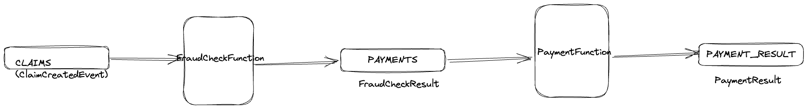

# Serverless and Data Streaming
  1. [Introduction](#introduction-)
  2. [Claim Service](##claim-service)
      * [Running Locally](#running-locally-for-development)
      * [Running on local k8s](#running-on-local-k8s-cluster)
      * [Running on AWS Lambda](#running-on-aws-lambda)
      * [Running on AWS EKS](#running-on-aws-eks)
      * [Running on Tanzu Application Service(TAS)](#running-on-tas)
      * [Running on OpenShift](#running-on-openshift)
      * [Running on KNative](#running-on-knative)
  3. [Claim Processor](#claims-processor)
  4. [Stream Processor](#stream-processor)
  5. [ClaimsCount Dashboard](#claim-count-dashboard-ui)

## Introduction 

There are many benefits to following clean and layered approaches to application architecture such as hexagonal arcthitecture. When application core is decoupled from transport details,the core functionality can be exposed in a manner to suit any business need, for e.g. as a REST endpoint or via asynchronous event listeners. It also means codebase that is testable by design. 

In the Java world, SpringFramework makes this very easy through Spring Cloud Function project. The idea is our application can be thought of as functions that take an input and produce output. The framework then provides support to deploy these functions as a REST service or via event listeners in a runtime environment of choice - Serverless, Kubernetes or stand alone event listeners.

The sample application illustrates how Spring Cloud Function can be used to write business logic as java functions and deploy anywhere for e.g., to a Serverless platform or as a REST endpoints or asynchronous Kafka event listeners. It also shows how the solution can easility be extended to implement an event streaming architecture, finishing off with an http end point serving Server Sent Events for real time notifications to a Web application.

The sample application implements a very simple Claim Processing solution where Customers can submit
claim requests that will then be processed according to the business rules resulting in customer getting paid or the
request being rejected.

The application consists of three main components.

- ClaimsService
- ClaimsProcessor
- StreamProcessor

Overall architecture diagram:

ClaimRequest submitted to ClaimService -> produces ClaimCreatedEvent -> ClaimProcessor picks the ClaimCreatedEvent to 
go through fraud check process to produce PaymentEvent which is processed by payment processor for the final settlement.


## Claim Service

The application exposes a http endpoint for users to submit their claim request. The service is implemented using 
Spring Cloud Function following hexagonal architecture principles.

At the core, the service is a function that accepts `ClaimRequest` to produce a `ClaimResponse` output. For simplicity,
`ClaimRequest` has following attributes:
```
{
   firstName: string,
   lastName: string,
   email: string,
   claimAmount: number,
   claimType: string
}
```

and `ClaimResponse` consists of
```
{
   status: {
      code: string,
      messate: string
   },
   correlationId: string
}
```

Service publishes `event` on a Kafka topic upon receipt of customer claim request.

### Running Locally for Development

- Run kafka locally
  - using Docker Compose
    `cd docker && docker-compose up` (ensure that docker daemon is running) It starts kafka with image 
    `bitnami/kafka:latest` which is kafka without zookeeper.

The application is a spring cloud function and can be started locally using the following command:
`./gradlew bootRun` 
To test, issuing following POST request,
```http request
POST http://localhost:8080/submitClaimRequest
Content-Type: application/json

{
  "firstName": "Joe",
  "lastName": "Blogs",
  "amount": 20,
  "claimType": "CLAIM_A",
  "email": "test@user.com"
}
```
will produce following response:
```json lines
{
  "status" : {
    "code": "UNDER_REVIEW",
    "message": "Application received"
  },
  "correlationId": "7d979021-5cc8-478d-8990-9d3d7c23b20a"
}
```

### Running on local K8s Cluster
#### Pre-requisites
- Local Kubernetes

`k3s` is lightweight distribution of Kubernetes perfect for resource constrained environments and a good choice for local
development environment. And [k3d](https://k3d.io/v5.4.9/#installation) can be used to run [k3s](https://k3s.io/) locally on Docker.
Also ensure [kubectl](https://kubernetes.io/docs/reference/kubectl/) is installed to connect to the cluster.
Create a local cluster with name `dev`
`k3d cluster create dev`
`kubectl get nodes` to list the nodes in the cluster.

- Kafka

We can start with hosted `kafka` solution, or deploy our own Kafka broker in the cluster. For a hosted solution
[https://www.confluent.io/get-started/](Confluent) is one option to get up and running quickly. 

#### Deployment

- build image using buildpack `./gradlew bootBuildImage`, which will build a local docker image `claimservice:0.0.1-SNAPSHOT`.
  [!IMPORTANT]
  Ensure that the thin jar plugin related config is commented out from `build.gradle.kts` to ensure that the image is built 
  using self-contained fat jar
- import the image into the cluster so that it is accessible to the deployments
  `k3d image import claimservice:0.0.1-SNAPSHOT -c {cluster-name}`
- `cd k8s`
- `kubectl create -f secrets.yaml` (for kafka credentials to connect to Confluent hosted broker)
- `kubectl create -f deployment.yaml`
- `kubectl create -f service-node-port.yaml` (to create a node port service for local testing)

The service can now be accessed at `POST http://localhost:30000/submitClaimRequest`

```http request
POST http://localhost:30000/submitClaimRequest
Content-Type: application/json
{
  "firstName": "Joe",
  "lastName": "Blogs",
  "amount": 20,
  "claimType": "",
  "email": "test@user.com"
}
```

### Running on AWS Lambda

SpringCloudFunction provides adapters for various serverless platforms. For AWS Lambda, we need
the spring cloud function adapter for aws and the thin jar plugin to produce the shaded jar for deployment.

```
implementation("org.springframework.cloud:spring-cloud-function-adapter-aws")
implementation("org.springframework.boot.experimental:spring-boot-thin-gradle-plugin:1.0.29.RELEASE")
```
and the following declarations in the `build.gradle.kts`

```
tasks.assemble{
	dependsOn("shadowJar")
}

tasks.withType<ShadowJar> {
    archiveClassifier.set("aws")
	dependencies {
		exclude("org.springframework.cloud:spring-cloud-function-web")
	}
	// Required for Spring
	mergeServiceFiles()
	append("META-INF/spring.handlers")
	append("META-INF/spring.schemas")
	append("META-INF/spring.tooling")
	transform(PropertiesFileTransformer::class.java) {
		paths.add("META-INF/spring.factories")
		mergeStrategy = "append"
	}
}

tasks.withType<Jar> {
	manifest {
		attributes["Start-Class"] = "com.arun.claimservice.ClaimserviceApplication"
	}
}

```
We also need a request handler to process incoming requests and Spring provides a generic request handler for this:
`org.springframework.cloud.function.adapter.aws.FunctionInvoker::handleRequest`

Following environment variables need to be defined for this function example  - `spring_profiles_active, KAFKA_USR, KAFKA_PASSWORD`

### Running on TAS
### Running on KNative
### Running on OpenShift
### Running on AWS EKS
#### Prerequisites

Create an AWS EKS cluster by following [instructions](https://docs.aws.amazon.com/eks/latest/userguide/getting-started.html) 
...

## Claims Processor

Claims Processor consists of functions that pick up the submitted claims for fraud check and then finalise the payment.
Following functions carry out fraud checks and processing of the payments. These functions are invoked by kafka message
listeners defined in `KafkaConfig`.

```kotlin
fun performFraudCheck(fraudCheckService: FraudCheckService): (ClaimCreatedEvent) -> FraudCheckResult {
    return {
       fraudCheckService.performFraudCheck(it)
    }
}
```

```kotlin
fun performPayment(paymentService: PaymentService): (FraudCheckResult) -> PaymentResult {
    return {
        paymentService.performPayment(it)
    }
}
```




## Stream Processor

In the first part, implemented a stream that listens to the `CLAIMS` topic for new claim requests, aggregates them by claim type and publishes
claim count by type on a new topic. Secondly implemented a REST endpoint via spring cloud function to serve events as they are published
on this new topic using reactor `Sink`.

### Implement Stream Topology

Stream topology is implemented in
```kotlin
    @Bean
    fun kStream(builder: StreamsBuilder) {
        claimsStream(builder)
    }
```
The stream topology above calculates number of claims by type in every five-minute window.

### REST API to serve from Stream
We can expose a REST api to serve the claim count as processed by the stream. For this we need to first define a sink for
the topic `event-count` where the claim count events are being published.

#### SINK set up

First define a sink
```kotlin
    @Bean
    fun claimCountSink(): Sinks.Many<ClaimCount> {
        val replaySink = Sinks.many().multicast().onBackpressureBuffer<ClaimCount>()
        return replaySink
    }
```
And then use this sink for the topic `event-topic` where claim count events are published by the stream.

```kotlin
@KafkaListener(
    topics = ["event-count"], groupId = "CONSUMER_ONE",
    containerFactory = "claimCountKafkaListenerContainerFactory"
)
class ClaimCountListener(private val sink: Sinks.Many<ClaimCount>) {
    private val logger = LoggerFactory.getLogger(ClaimCountListener::class.java)

    @KafkaHandler
    fun processMessage(claimCount: ClaimCount) {
        logger.info("Received claim count $claimCount")
        sink.emitNext(claimCount, { s,e -> true})
    }
}
```

#### Spring Cloud Function set up

Following function exposes `retrieveClaimCount` endpoint which will publish claim count events as server sent events.

```kotlin
    @Bean
    fun retrieveClaimCount(claimCountSinks: Sinks.Many<ClaimCount>): () -> Flux<ClaimCount> {
        return retrieveClaimCountFunction(claimCountSinks)
    }
```

### Claim Count Dashboard (UI)

The dashboard uses `EventSource` to streaming event counts from the API to the browser which is then displayed in a 
line chart.

```typescript
import {useEffect} from "react";

const eventSource = new EventSource(`http://localhost:8081/retrieveClaimCount`);
...
eventSource.onmessage = m => {
...
    // display events in the chart
}
```
The react app `claims-ui` can be started by running `npm run dev` and navigate to `http://localhost:3000/claimCount`


### Scheduler to generate test events 


The function taking KStream as input is not getting invoked, but the others with bytearray inputs are invoked and can also
be chained together to feed output from one as input to the other.
